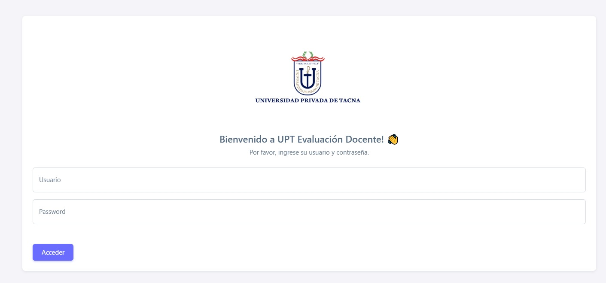
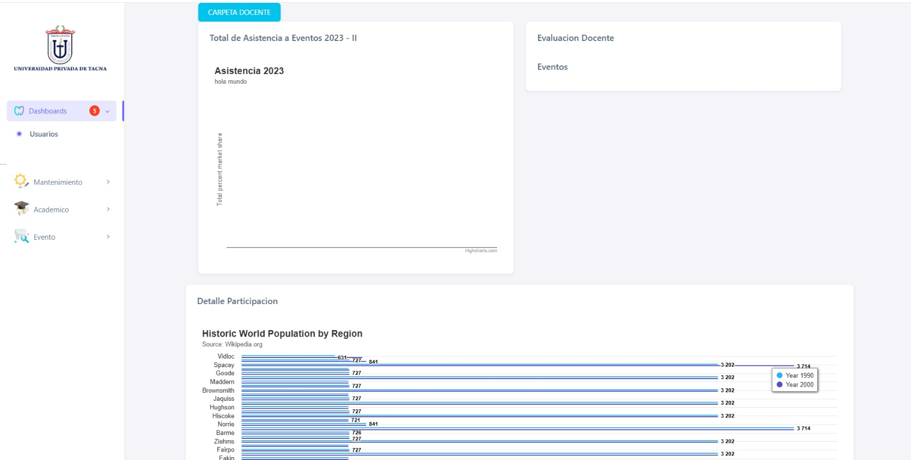
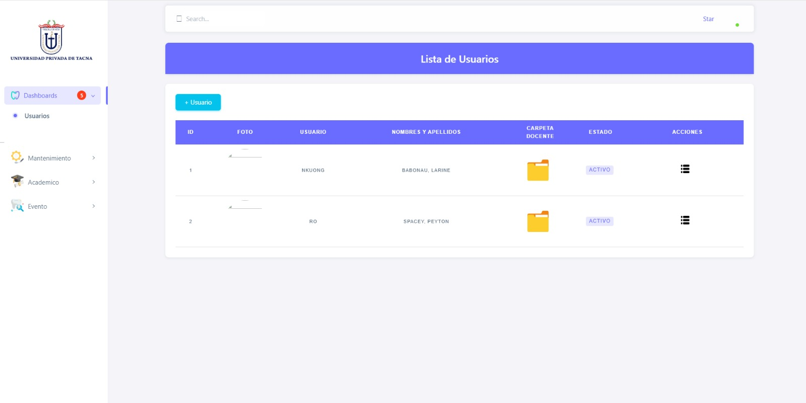
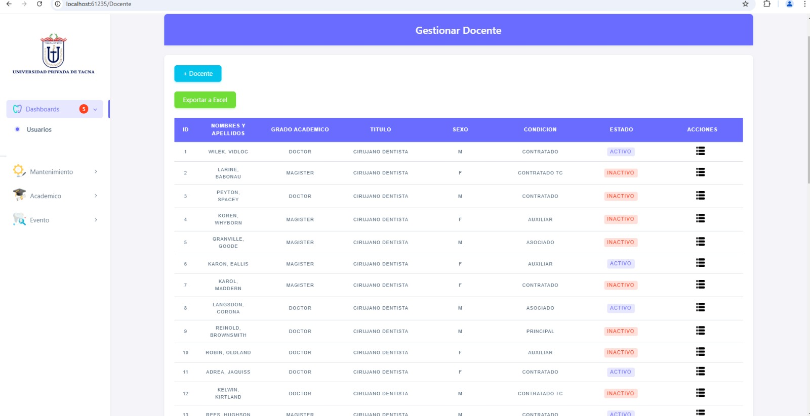

# 📌 Sistema de Gestión y Evaluación de Docentes  
📍 **Escuela de Odontología - Universidad Privada de Tacna**  

## 📖 Descripción  
Este sistema permite la gestión eficiente de docentes en la **Escuela de Odontología**. Facilita el **registro de usuarios, evaluación docente, administración de roles y reportes académicos**.  

## 🚀 Funcionalidades  
✔ Registro y gestión de usuarios (administradores, docentes y estudiantes).  
✔ Evaluación docente mediante criterios predefinidos.  
✔ Registro y control de asistencias.  
✔ Administración de semestres y planes de estudio.  
✔ Generación de reportes académicos detallados.  
✔ Notificaciones de eventos educativos importantes.  
✔ Interfaz web intuitiva y adaptable.  

---

## 🖥️ **Cómo Usar el Sistema**  

### **1️⃣ Login de Acceso**  
El usuario debe ingresar sus credenciales en la pantalla de inicio de sesión.  
📌 **Ejemplo:**  
  

### **2️⃣ Dashboard del Proyecto**  
Una vez dentro, el usuario accede al panel de control, donde puede gestionar todas las funcionalidades.  
📌 **Ejemplo:**  
  

### **3️⃣ Lista de Usuarios**  
El administrador puede visualizar la lista de usuarios registrados y gestionar permisos.  
📌 **Ejemplo:**  
  

### **4️⃣ Gestión de Docentes**  
Permite registrar nuevos docentes, modificar datos y asignarles roles específicos.  
📌 **Ejemplo:**  
  

---

## 🛠️ **Tecnologías Utilizadas**  
✅ **ASP.NET MVC** - Estructura del sistema  
✅ **C#** - Desarrollo del backend  
✅ **SQL Server** - Base de datos  
✅ **HTML, CSS, JavaScript** - Interfaz de usuario  
✅ **Bootstrap** - Diseño responsivo  

---

## 📥 **Instalación y Configuración**  
### **1️⃣ Clonar el Repositorio**  

git clone https://github.com/UPT-FAING-EPIS/proyecto-si982-2024-rec-u3-gestiondocentes_delacruz_vela_web2.git
cd sistema-evaluacion-docentes

**Casos de Uso** 

1. **Registro de Usuarios** 

   

2. **Inicio de Sesión** 

   

3. **Gestión de Roles** 

   

4. **Evaluación de Docentes** 

   

5. **Creación y Edición de Semestres** 

   

6. **Asociación de Planes de Estudio con Semestres** 

   

7. **Registro de Asistencias de Docentes** 

   

8. **Generación de Reportes Académicos** 

   

9. **Configuración de Perfil de Usuario** 

   

10. **Notificaciones de Eventos Importantes**

    

**Diagrama de Secuencia** 

1. **Registro de Usuarios** 

   

2. **Inicio de Sesión** 

   

3. **Gestión de Roles** 

   

4. **Evaluación de Docentes** 

   

5. **Creación y Edición de Semestres** 

   

6. **Asociación de Planes de Estudio con Semestres** 

   

7. **Registro de Asistencias de Docentes** 

   

8. **Generación de Reportes Académicos** 

   

9. **Configuración de Perfil de Usuario** 

   

10. **Notificaciones de Eventos Importantes**

